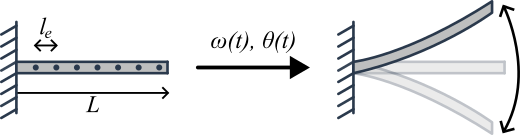

<div align="center">

# Euler–Bernoulli Beam Model for Flapping Wings
</div>

This repository provides a MATLAB implementation of a finite-element Euler–Bernoulli beam model with prescribed root rotation, time integration via Runge–Kutta (RK4), and a solar power proxy based on the dot product between the Sun vector and time-varying local surface normals inferred from nodal rotations. The workflow supports parametric sweeps in flapping frequency and amplitude, as well as different PV element “block” placements along the span.

<p align="center">
  
</p>

## Key capabilities
- Euler–Bernoulli beam FE model:
  - global stiffness/mass assembly
  - boundary condition reduction (clamped root, prescribed rotation)
- Time integration of the reduced-order system
- Smooth ramp-in of prescribed motion (smootherstep)
- Solar power proxy:
  - precomputed Sun vector in the body frame
- Parametric sweeps:
  - frequency (Hz) and amplitude (deg)
  - PV block placement along nodes
- Spectral post-processing:
  - Welch PSD and spectrogram of total power signal

## Requirements
- MATLAB R20XXa or later
- Signal Processing Toolbox recommended (for `pwelch` / `spectrogram`)

## Assumptions and limitations (summary)
- Structural model: linear Euler–Bernoulli bending with small strains.
- Kinematics: nodal rotations are used to approximate local panel orientation.
- “Power” is a proxy proportional to irradiance projection; it does not include full PV I–V dynamics or MPPT behavior.

## Corresponding authors

- [Vítor D. Marchiori](http://lattes.cnpq.br/5431211572935053)
- [Rodrigo B. Santos](http://lattes.cnpq.br/6783847794438620)
- [Douglas D. Bueno](https://feis.unesp.br/douglasbueno) 

## How to cite

The content is available for non-commercial research under the following terms: (i) GMSINT Group and UNESP Ilha Solteira should be acknowledged as the source of the data; (ii) this repository should be cited as follows:

> Marchiori, V. D.; Santos, R. B.; Bueno, D. D. (2025). *Flapping-wings UAV: CAD Prototype*. GitHub, https://github.com/vitordmarchiori/Flapping-Wing-Beam-Simulation.

### BibTeX

If you are using a LaTeX Editor, you can cite this repository using these BibTeX citations:

```bibtex
@misc{marchiori2025,
  author       = {Marchiori, Vítor D. and Santos, Rodrigo B. and Bueno, Douglas D.},
  title        = {Euler--Bernoulli Beam Model for Flapping Wings},
  year         = {2025},
  howpublished = {\url{https://github.com/vitordmarchiori/Flapping-Wing-Beam-Simulation}},
  note         = {[Simulation codes]. GitHub}
}
```

## Funding
São Paulo Research Foundation, [FAPESP](https://fapesp.br/en), Grant number 2023/15904-4.


## License
Creative Commons Attribution-NonCommercial-ShareAlike (CC-BY-NC-SA): A creative commons license that bans commercial use and requires you to release any modified works under this license.
